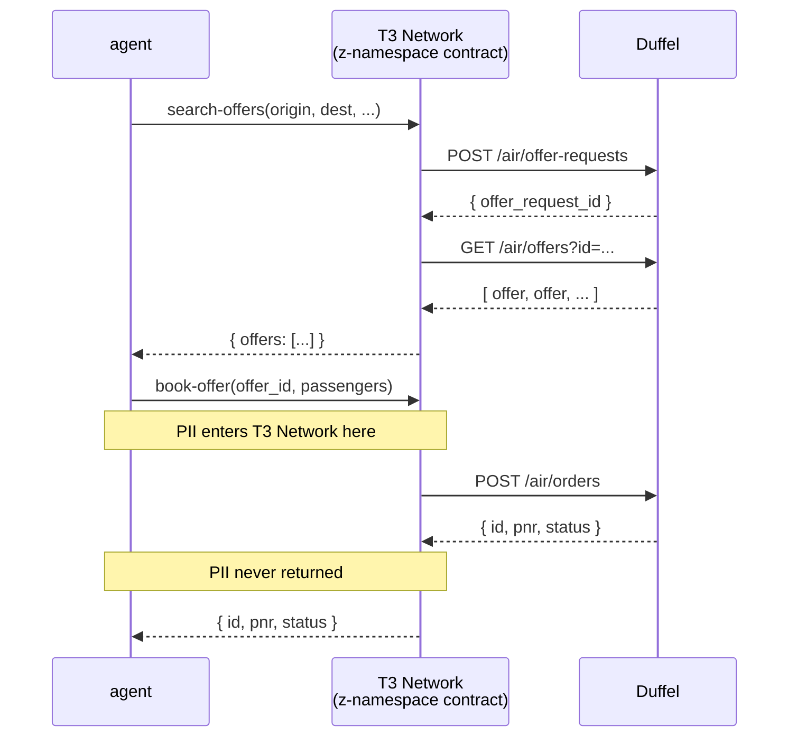

# z-tenant-flight

Duffel flight booking showcase for Trinity z-namespace tenants — v0.3.0.

A Rust WASM contract that runs inside the Trinity TEE (Trusted Execution Environment) and calls the [Duffel](https://duffel.com) API synchronously via `host:interfaces/http`.

## What this is

Two contract functions exposed over WIT:

| Function | What it does |
|---|---|
| `search-offers` | POST to Duffel `/air/offer-requests`, then GET `/air/offers` — returns a list of available flights |
| `book-offer` | POST to Duffel `/air/orders` with full passenger PII — returns the booking ID and PNR |

Privacy guarantee: passenger PII (passport number, date-of-birth, full name, email, phone) is passed in by the agent and used inside the enclave to call Duffel. Only the booking ID and PNR cross the WIT boundary back to the caller. Error responses from Duffel are logged inside the TEE and never forwarded to the caller.

## Host-capability manifest

Declare in your contract manifest:

```json
{ "host_capabilities": ["kv_store", "logging", "tenant_context", "http"] }
```

The `http` capability enables outbound HTTP via the `tenant-http` linker world.

## Setup: providing the Duffel API key

Before deploying or calling this contract for the first time, the tenant SDK must:

1. Create the `secrets` KV map in the z: namespace.
2. Write the Duffel API key under the key `duffel_api_key`.

```bash
# Example via the tenant SDK / admin tooling:
z_sdk.kv("secrets").set("duffel_api_key", "<your Duffel test API token>")
```

The contract reads this value at runtime using `host:interfaces/kv-store` — no `secret` interface is involved. The `secrets` map is owned and populated externally by the tenant operator; the contract never writes to it.

## Building

```bash
rustup target add wasm32-wasip2
cargo build --target wasm32-wasip2 --release
```

The WASM artefact will be at `target/wasm32-wasip2/release/z_tenant_flight.wasm`.

## Running tests (native)

```bash
cargo test --lib
cargo clippy --all-targets -- -D warnings
```

## Contract functions

### `search-offers`

```wit
search-offers: func(req: search-offers-req) -> result<search-offers-resp, string>;
```

Input:

```json
{
  "origin": "LHR",
  "destination": "JFK",
  "departure_date": "2026-07-15",
  "cabin_class": "economy",
  "adult_count": 1
}
```

Returns a list of `offer` records, each with `id`, `total_amount`, `total_currency`, and `expires_at`.

### `book-offer`

```wit
book-offer: func(req: book-offer-req) -> result<booking, string>;
```

Input:

```json
{
  "offer_id": "off_abc123",
  "passengers": [
    {
      "given_name": "Jane",
      "family_name": "Smith",
      "date_of_birth": "1990-01-15",
      "passport_number": "AB1234567",
      "nationality": "GB",
      "passport_expiry": "2030-06-01",
      "gender": "f",
      "email": "jane@example.com",
      "phone": "+441234567890"
    }
  ],
  "total_amount": "199.00",
  "total_currency": "GBP"
}
```

Returns `{ "id": "ord_...", "pnr": "ABC123", "status": "confirmed" }`.

## Architecture



